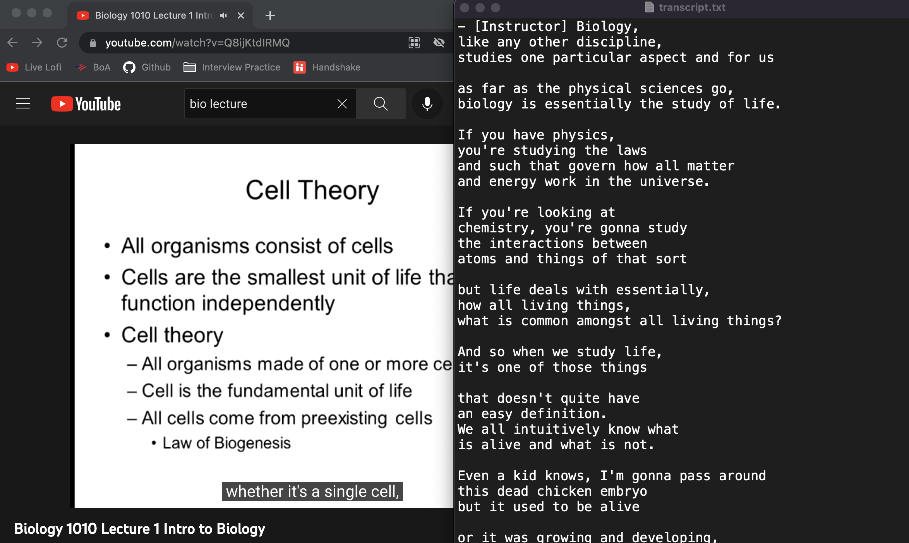

# Youtube Transcript App

## Description
Converts a Youtube video to a text file compiled with the video's captions. The app runs through the terminal and was created with NodeJS. It scrapes the captions from the given link. 

## Instructions To Run
1. Download source code and run `npm i` in command line to install dependencies. 
2. Run `npm run start` to start the application.
3. Input the a Youtube video link.

## Screenshot

Last Updated on 9/23/22
